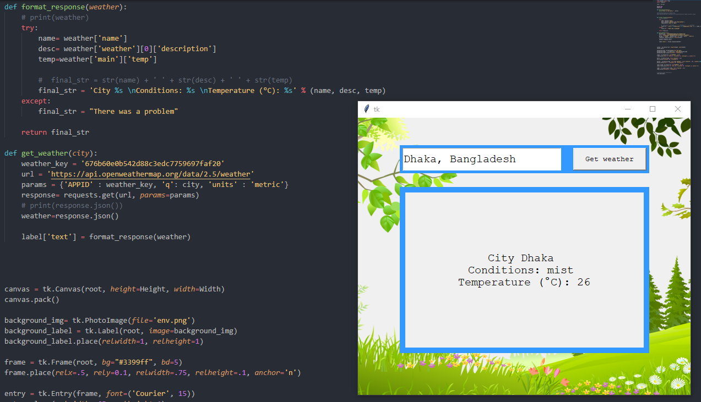

# Tkinter
Python tkinter gui library applications. 

## [PartsApp](https://github.com/nou-ros/PyLab/tree/master/_03_TkinterLab/_01_parts_app)

## General info
Simple computer parts management application. We can add, update, and delete parts. Customers information will show in the white screen. 

## Screenshots

## Technologies
* tkinter
* sqlite3

## [Weather App](https://github.com/nou-ros/PyLab/tree/master/_03_TkinterLab/_02_weather_app)

## General info
Simple weather application using openweathermap api.

## Screenshots

## Technologies
* tkinter
* requests
