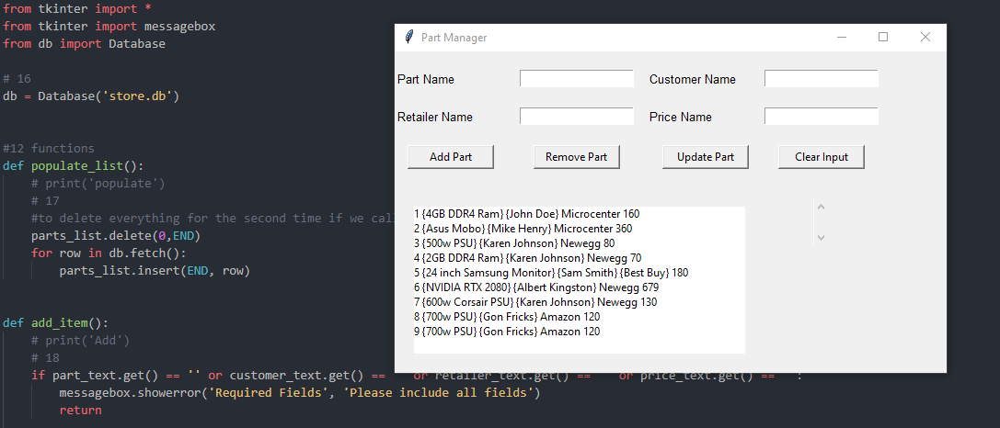

# Tkinter
Python tkinter gui library applications. 

* [PartsApp] (https://github.com/nou-ros/PyLab/tree/master/_03_TkinterLab/_01_parts_app)

## General info
Simple computer parts management application using tkinter gui toolkit. You can add, update, and delete parts. Customers information will show in the white screen. 

## Screenshots

## Technologies
* tkinter
* sqlite3

* Weather App
