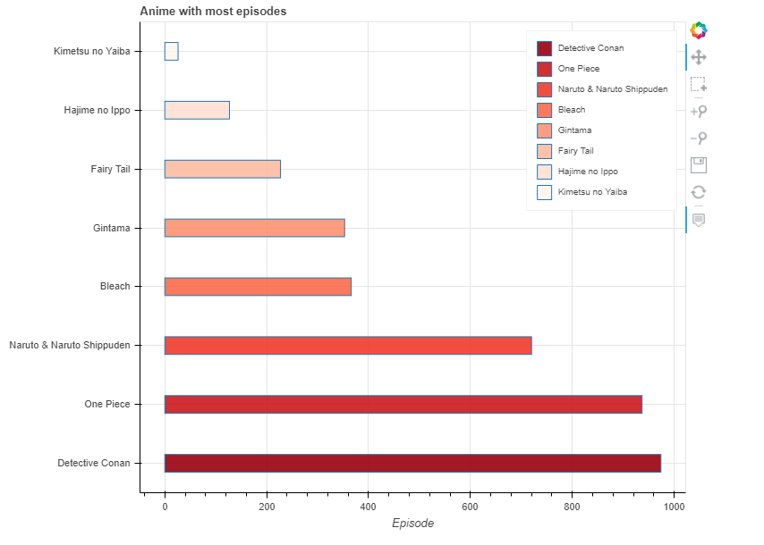

# Bokeh Library
> Bokeh Anime is a demo project to test python bokeh library.

## Table of contents
* [General info](#general-info)
* [Technologies](#technologies)
* [Screenshots](#screenshots)

## General info
To show the tabular data with bokeh visualization library in the browser. 

## Technologies
* Numpy
* Bokeh

## Screenshots

## Contact
Created by [@nourosO_O](https://twitter.com/nourosO_O) - feel free to contact me!
